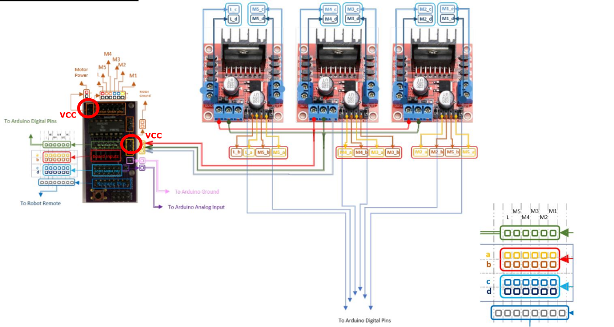

The most important lesson that this project taught Sankalp and I can be summed up with one sentence.

**Read the data sheets and documentation for any components or libraries used!**

The electrical components used are the following:
1. 5V-8V DC Motor
2. L298N Motor Driver modules
3. PCB Provided from class. Contains a SN7404 hex inverter.
4. STM32 Microcontroller

The biggest difficulty we faced was not in writing the python or the microcontroller program, rather it was in finalizing electrical connections to reliably control the OWI Arm.

Our initial electrical connections followed the diagram below, per a previous class assignment.

Note that the two pins circled and labeled as VCC are connected with a trace. That is, the input voltage across the first set circled pins will be the same across the second set. Thus the L298N Modules will be powered from the same source. This source also serves as the supply for the SN7404 Hex Inverter on the PCB.

By using the Hex Inverter, we can decrease the amount of microcontroller pins needed to operate the motors. The L298N modules have pins labeled IN1 and IN2 as well as IN3 and IN4 that work as separate pairs. The L298N will output the supply Voltage (with any PWM provided as input) when IN1 and IN2 are inverted. That is, when IN1 is logic high, IN2 must be logic low, and vice versa. When both pins are both high or both low, the output will be grounded.

After noticing that the motors struggled to operate with a 5V input voltage, we decided to increase the input to 7V. Ultimately this caused issues that could have been prevented had we thought to look at the input voltage for the Hex Inverter. 

)

Given that the inverter supply on the PCB we received was tied to the input Voltage, we ended up applying 7V to a IC that requires a maximum of 5.25V. With this condition, the motors only moved in one direction when the input pin was set low. When setting the input pin high no motor would move. After losing multiple hours checking wire connections, we acquired a volt meter and noticed the supply voltage across the inverted pin when setting the input pin low. When setting the input pin high, both pins measured the same voltage, about 2.5V-3V.

After seeing the measured Voltages, we got the epiphany to check the data sheets for the inverter to look for the max supply voltage. We made the mistake of using 7V for the inverter supply and expecting normal operation. After this, we forgoed using the inverter and instead used 5 additional microcontroller pins for the inverted pins. The reason for this is that we still needed 7V to power the motors.

Overall, this was a good lesson to have as we often don't think about having issues with the most basic things. Troubleshooting circuits is not much different from debugging code, so there is a lot of merit in reading initial documentation to learn about what will be used in any project.
