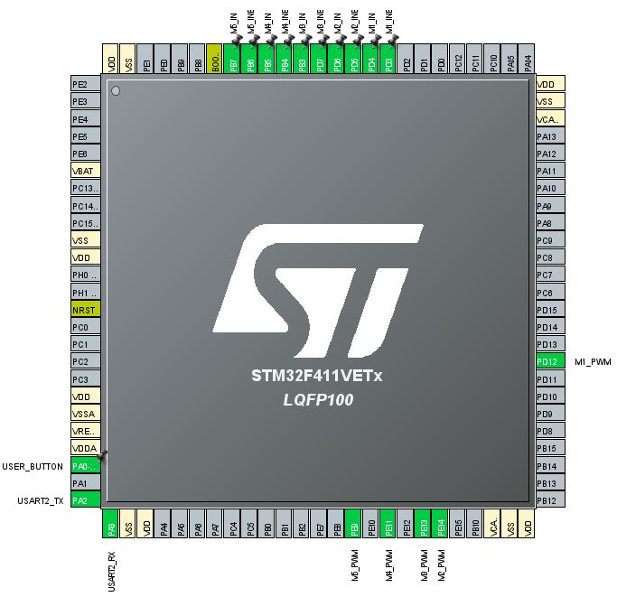
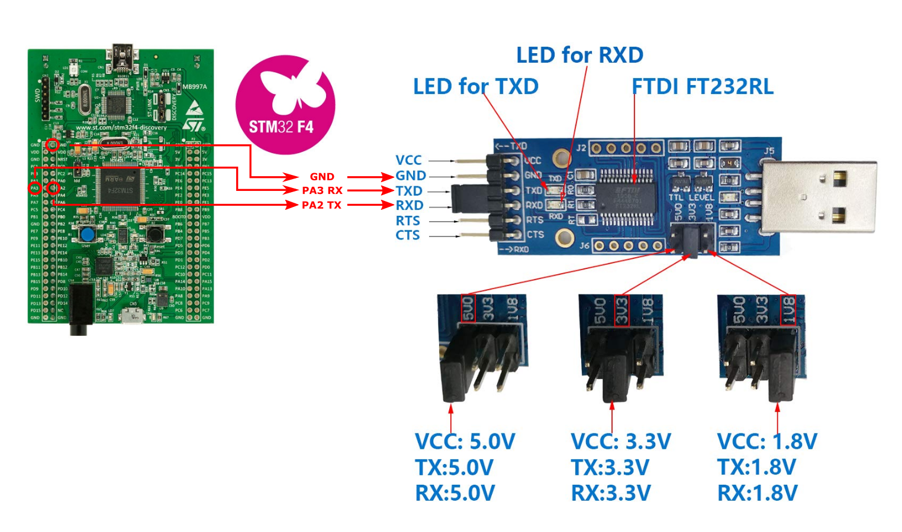
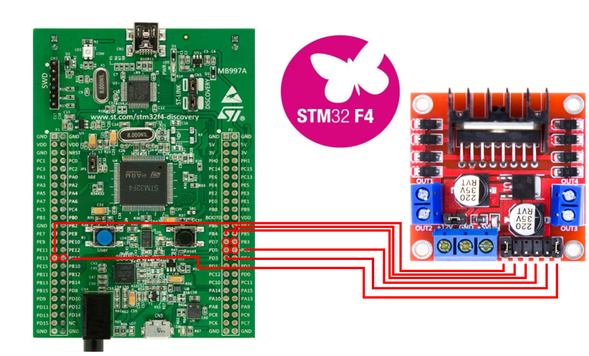

# **ECE 5330 Final Project: Lego Color Sorting via Camera Feedback**

Clone the repo to a local folder in your computer.
**Note:** This application uses Python 3.5 and up. Verify that the python installation location is in PATH.

# **Table of Contents**

- [Project Description](#Project-Description)
- [Setting up the Software](#Setting-up-the-Software)
  - [Downloading Dependencies](#Downloading-Dependencies)
  - [Running the Python Application](#Running-the-Python-Application)
- [STM32 Microcontroller](#STM32-Microcontroller)
  - [Programming the STM 32 Microcontroller](#Programming-the-STM32-Microcontroller)
  - [Pin Connections](#Pin-Connections)
  - [List of Components](#List-of-Components)
  - [Serial Communication](#Serial-Communication)
    - [Running the Application without Microcontroller](#Running-the-Application-without-Microcontroller)
  - [Motor Driver Connections](#Motor-Driver-Connections)
- [Running the Project](#Running-the-Project)

# **Project Description**

The project is composed of two sections:

1. The python application: Camera_Data_Detection.py.
2. The STM32F411VE microcontroller program located in the STM folder.

**Note:** The python application may be run independently without the microcontroller.

**WARNING:** The microcontroller program will only work correctly when the motor, L298N, and USB Serial connections are set correctly.
The python application must be running for the microcontroller to sucessfully maneuver the OWI arm.

The python application uses the opencv in conjuction with a STM32 microcontroller.
Camera data is sent to the STM32 microcontroller via Universal Asynchronous Receiver-Transmitter (UART) connection.

The microcontroller used for this project is the [STM32F411VE Discovery board](https://www.st.com/en/evaluation-tools/32f411ediscovery.html).
The firmware was written using STM's HAL library, as well as compiled and written using the [STM32CubeIDE](https://www.st.com/en/development-tools/stm32cubeide.html).

# **Setting up the Software**

**Note:** This project was written on Windows 10, there may be issues when attempting to run the python
application on MacOS or Linux Distros.

## **Downloading Dependencies**

The project was written with Python 3, specifically Python 3.7.5, and its dependencies installed globally.
A virtual environment may be set up locally if needed. The instructions in this file only enumerate global installation of the dependencies.

1. To install Python 3 on Windows go to the [Python Downloads Page](https://www.python.org/downloads/) and download the most recent version. (Install to PATH)

   **Note:** Use both of the following commands on PowerShell or CMD to verify the python installation.
    - `python --version`  
    
    - `python3 --version ` 

    Python may be installed as _python_ or _python3_ depending on whether previous versions were already installed. Use the correct python command for the rest of the commands.  
    The instructions after this point assume Python was installed as *python3*.  
    
    **Note: Some of the following steps may be skipped if the packages are already installed on your system**

2. Use the following command for opencv install. Click here for the [OpenCV-Python](https://pypi.org/project/opencv-python/) page.

   - `python3 -m pip install opencv-python --upgrade`

3. Use the following command to install _pyzbar_. Click here for the [Pyzbar](https://pypi.org/project/pyzbar/) page.

   - `python3 -m pip install pyzbar --upgrade`

4. Use the following command to install _pyserial_. Click here for the [Pyserial](https://pypi.org/project/pyserial/) page.

   - `python3 -m pip install pyserial --upgrade`

5. Use the following command to install _numpy_. Click here for the [Numpy](https://pypi.org/project/numpy/) page.
   - `python3 -m pip install numpy --upgrade`

## **Running the Python Application**

1. Download the project by either cloning to a local folder, or downloading the repository as a zip file and extracting.

2. Navigate to the project folder on your terminal.
3. Enter either of the following commands to run the python application. Before running, connect a USB webcam to the computer.

   - To run the application with default capture device 0 and no serial communication, run without arguments:

     `python3 Camera_Data_Detection.py`

   - To run the application without serial communication and different capture device:

     `python3 Camera_Data_Detection.py 1`

     **Note:** The argument 1 is used to set the openCV video capture device. On laptops, the built-in webcam may be set as capture device 0. Extra USB webcams may be set as capture device 1 or above.

   - To run the application with a specific capture device and serial port use:

     `python3 Camera_Data_Detection.py 1 COM3`

     **Note:** The second argument 'COM#' especifies the Windows COM Port for the microcontroller.  
      - On Linux distros or Mac OS, USB devices are usually listed under _/dev/_ as _/dev/TTYSx_ or _/dev/TTYUSBx/_.

     **WARNING:** The STM32F411VE microcontroller does not have a USB-to-Serial converter chip such as Arduinos have. A separate USB-to-TTL adapter must be used with the STM32 pins.  
     
     The **COM PORT** must be available on the computer (Device Manager on Windows) for the Python application to run successfully.
     See the [Serial Communication](##Serial%20Communication) section for instructions on setting up the converter.

# **STM32 Microcontroller**
The STM32F4 Discovery board was programmed using STM32CubeIDE. The entire project folder for the microcontroller firmware can be found in the [STM32 folder](./STM32/).
## Programming the STM32 Microcontroller
To program the microcontroller:
  - Open the project folder with STM32CubeIDE.
  - Open the file `main.c` in the`src` folder.
  -  Under the *Project* file menu, click on *Build All* or use the keyboard shortcut *Ctrl + B*.
  -  Under the *Run* file menu, click on *Debug* or press *F11* to write to the microcontroller and Debug.  
  
**Note:** The Microcontroller is programmed to wait for the Blue `USER` button press, before running the program.
## **List of Components**  

| **Component**| **Description** |
| --------| ------------ |
|OWI-535 Robotic Arm Edge| The Robot Arm used. The kit contains the DC motor.|
|L298N| Motor Drive Controller board|
|DSD Tech SH-U09C2| USB-to-TTL Adapter with built-in FTDI|
|Microsoft LifeCam HD-30000| USB Webcam used for the video capture|
|STM32F4 Discovery Kit| Microcontroller used for the project|

## **Pin Connections**

| **STM32F411 Pin Number** | **Peripheral Mode** | **Use Label** | **Description** |
| -------------------  | ---------| --------- |-----------|
|PD4 | GPIO Output | 	M1_IN  | General Output used for L298N Motor Direction Control: IN3|
|PD3 | GPIO Output | 	M1_INB | General Output used for L298N Motor Direction  Control: IN4|      
|PD6 | GPIO Output | 	M2_IN |General Output used for L298N Motor Direction  Control: IN3|
|PD5 | GPIO Output | 	M2_INB |General Output used for L298N Motor Direction  Control: IN4|
|PB3 | GPIO Output | 	M3_IN |General Output used for L298N Motor Direction  Control: IN1|
|PD7 | GPIO Output | 	M3_INB |General Output used for L298N Motor Direction  Control: IN2|
|PB5 | GPIO Output | 	M4_IN |General Output used for L298N Motor Direction  Control: IN3|
|PB4 | GPIO Output | 	M4_INB |General Output used for L298N Motor Direction  Control: IN4|
|PB7 | GPIO Output | 	M5_IN |General Output used for L298N Motor Direction  Control: IN1|
|PB6 | GPIO Output | 	M5_INB |General Output used for L298N Motor Direction  Control: IN2|
|PA0-WKUP | GPIO Input | 	USER_BUTTON | Blue "User" Button to start program on press.|
| PD12 |	TIM4_CH1|	M1_PWM | PWM generation on Timer 4 channel 1 for L298N Motor PWM input: ENB |
| PE14 |	TIM1_CH1|	M2_PWM |PWM generation on Timer 1 channel 1 for L298N Motor PWM input: ENB|
| PE13 |	TIM1_CH2|	M3_PWM |PWM generation on Timer 1 channel 2 for L298N Motor PWM input: ENA|
| PE11 |	TIM1_CH3|	M4_PWM |PWM generation on Timer 1 channel 3 for L298N Motor PWM input: ENB|
| PE9 |	TIM1_CH4|	M5_PWM |PWM generation on Timer 1 channel 4 for L298N Motor PWM input: ENA|
| PA2| USART2_TX| | USART2 Transmitter pin | 
| PA3| USART2_RX| | USART2 Receiver pin|

See [Motor Driver Connections](#Motor-Driver-Connections) for information on the pin connections between the microcontroller and L298N Driver module.
## **Serial Communication**

The USB-to-TTL image above can be found at the following [link](https://www.amazon.com/DSD-TECH-SH-U09C2-Debugging-Programming/dp/B07TXVRQ7V).  
The Microcontrolloer image is found at at following [link](https://www.st.com/en/evaluation-tools/stm32f4discovery.html).  

Upon plugging in the USB-to-TTL adapter to the computer, Windows may automatically detect and download the necessary FTDI drivers. A new COM Port should be detected and seen on the Device Manager.  

**NOTE:** In the case that the adapter is not recognized, download the latest drivers for the FT232RL chip from [FTDI's website](https://www.ftdichip.com/Products/ICs/FT232R.htm). 

### Running the Application without Microcontroller
When a USB-to-TTL adapter is plugged-in to the computer, the Python application will run successfully with a COM port as argument:
  - `python3 Camera_Data_Detection.py 1 COM3` 
  
In this case, computer recognizes the adapter as a Serial Device and can therefore receive data. The Microcontroller need not be connected to the USB-to-TTL adapter when trying to view Camera Output.
  
## **Motor Driver Connections**

The following diagram shows the microcontroller pin connections for pins PD7, PB3, PD5, PD6, PE13 and PE14. See [Pin Connections](#Pin-Connections) for more information about the pins.

The OWI-535 Arm has five DC motors. As a result, three L298N Modules will be needed.

# Running the Project
In order to run the entire project the following conditions must be completed:
1. Set all of the L298N Connections with the Microcontroller. See the [Motor Driver Connections](#Motor-Driver-Connections) section for more details.
2. Verify the OWI-535 Robot Arm motor connections with the L298N Module.
3. Set all of the Serial-to-TTL connections between the Microcontroller and the adapter. See [Serial Communication](##Serial%20Communication) section for more details.
4. Verify that the USB-to-TTL adapter is plugged into a computer USB Port, and verify its COM Port.
5. Verify that the USB Webcam is connected to a USB Port and verify its Capture Device Number. See [Running the Python Application](#Running-the-Python-Application) for more details.

Once the conditions above are completed, run the python application first before pressing the blue `USER` button on the microcontroller.
